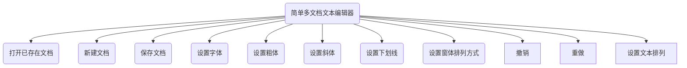

```mermaid
graph TD
start(简单多文档文本编辑器) --> open(打开已存在文档)
start --> new(新建文档)
start --> save(保存文档)
start --> setFont(设置字体)
start --> setBold(设置粗体)
start --> setItalic(设置斜体)
start --> setUnderline(设置下划线)
start --> setAl(设置窗体排列方式)
start --> 撤销
start --> 重做
start --> 设置文本排列
```